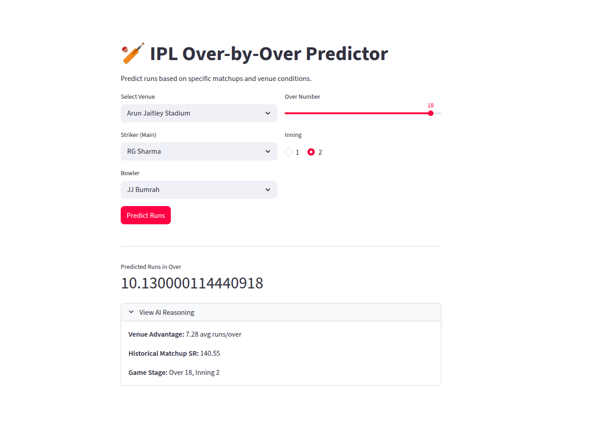

# 🏏 IPL Over-by-Over Run Predictor

A machine learning web application that predicts how many runs will be scored in a specific over of an IPL match, based on the venue, batter-bowler matchup, over number, and inning.



---

## 📌 What It Does

Given the following inputs:
- **Venue** — The stadium where the match is being played
- **Striker (Batter)** — The main batter currently at the crease
- **Bowler** — The bowler delivering the over
- **Over Number** — Which over is being played (0–19)
- **Inning** — 1st or 2nd inning

The model predicts the **expected runs scored in that over**, and also exposes the AI's reasoning:
- Venue average scoring rate (runs/over)
- Historical batter vs bowler strike rate
- Game stage context (over + inning)

---

## 🗂️ Project Structure

```
ipl_model/
├── app.py                  # Streamlit web app (UI + prediction logic)
├── prepare_db.py           # Parses IPL JSON files and builds the SQLite database
├── cricket_detailed.db     # SQLite database with all match & delivery data
├── ipl_model_v1.json       # Trained XGBoost model (saved in XGBoost native format)
├── ipl_json/               # Raw IPL match data in Cricsheet JSON format
│   ├── 1082591.json
│   ├── 1082592.json
│   └── ...
├── .gitignore
└── README.md
```

---

## 🧠 How the Model Works

### 1. Data Pipeline (`prepare_db.py`)

Raw IPL match data in [Cricsheet](https://cricsheet.org/) JSON format is parsed and loaded into a local SQLite database (`cricket_detailed.db`).

**Database Schema:**

**`matches` table**
| Column    | Type    | Description                     |
|-----------|---------|---------------------------------|
| match_id  | INTEGER | Unique match identifier (PK)    |
| venue     | TEXT    | Stadium name                    |
| winner    | TEXT    | Winning team name               |

**`deliveries` table**
| Column       | Type    | Description                            |
|--------------|---------|----------------------------------------|
| match_id     | INTEGER | FK → matches                           |
| inning       | INTEGER | 1 or 2                                 |
| over         | INTEGER | Over number (0-indexed)                |
| ball         | INTEGER | Ball number within the over            |
| batter       | TEXT    | Batter's name                          |
| bowler       | TEXT    | Bowler's name                          |
| runs_batter  | INTEGER | Runs scored off the bat                |
| runs_extras  | INTEGER | Extra runs (wides, no-balls, etc.)     |
| is_wicket    | INTEGER | 1 if a wicket fell, 0 otherwise        |

The composite primary key `(match_id, inning, over, ball)` prevents duplicate delivery entries.

Two SQL views are also created for fast feature lookups:
- **`view_venue_stats`** — Average runs per over at each venue
- **`view_player_matchups`** — Strike rate for every batter vs bowler combination

---

### 2. Feature Engineering

The model uses the following features:

| Feature                 | Description                                                                 |
|-------------------------|-----------------------------------------------------------------------------|
| `over`                  | The over number (0–19), captures game phase (powerplay, middle, death)      |
| `venue_scoring_index`   | Average runs/over at the selected venue (fetched from `view_venue_stats`)   |
| `matchup_strike_rate`   | Historical SR of the batter against this specific bowler                    |
| `venue_<name>`          | One-hot encoded venue column                                                |
| `inning_<1 or 2>`       | One-hot encoded inning column                                               |

**Fallback logic for matchup strike rate:**
1. If the batter and bowler have faced each other before → use their specific historical SR
2. If they've never faced each other → use the batter's career average SR across all matchups
3. If the batter has no history at all → default to `100.0`

---

### 3. The XGBoost Model

The model is an `XGBRegressor` trained to predict `runs_scored_in_over` (a regression target, not classification).

- **Model file:** `ipl_model_v1.json` (XGBoost native JSON format)
- **Input:** 44 features (3 numeric + one-hot encoded venues and innings)
- **Output:** Continuous predicted run value (clipped to ≥ 0 in the UI)

---

## 🖥️ Web App (`app.py`)

Built with [Streamlit](https://streamlit.io/). The app:

1. Loads the trained XGBoost model (cached with `@st.cache_resource` so it only loads once)
2. Reads all unique venues, batters, and bowlers from the database to populate dropdowns
3. On "Predict Runs" click:
   - Fetches `venue_scoring_index` and `matchup_strike_rate` from the DB
   - Constructs a 44-column feature DataFrame matching the model's training schema
   - Runs `model.predict()` and displays the result
   - Shows AI reasoning in an expandable section

---

## 🚀 Running the App

### Prerequisites

Make sure you have a Python virtual environment set up with the required packages:

```bash
# Create and activate a virtual environment
python3 -m venv .venv
source .venv/bin/activate

# Install dependencies
pip install streamlit xgboost pandas sqlite3
```

### Step 1 — Build the Database

If `cricket_detailed.db` doesn't exist yet, run:

```bash
.venv/bin/python prepare_db.py
```

This will parse all JSON files in the `ipl_json/` folder and populate the database.

### Step 2 — Run the App

```bash
.venv/bin/streamlit run app.py --server.headless true
```

Then open your browser at:
- **Local:** http://localhost:8501
- **Network:** http://<your-local-ip>:8501

---

## � Results & Output

After clicking **"Predict Runs"**, the app displays:

### 🎯 Predicted Runs in Over
A large metric card showing the model's predicted run total for that specific over, rounded to 2 decimal places and floored at `0` (no negative predictions).

Example:
```
Predicted Runs in Over
───────────────────────
        8.43
```

### 🔍 View AI Reasoning (Expandable)
A collapsible section that breaks down the 3 key factors the model used to arrive at the prediction:

| Field                      | What It Means                                                                 |
|----------------------------|-------------------------------------------------------------------------------|
| **Venue Advantage**        | The average runs scored per over at this venue across all historical matches  |
| **Historical Matchup SR**  | The batter's strike rate specifically against this bowler (or career SR fallback) |
| **Game Stage**             | The over number and inning used as context for the prediction                 |

Example reasoning output:
```
Venue Advantage: 8.21 avg runs/over
Historical Matchup SR: 145.83
Game Stage: Over 15, Inning 2
```

### ⚠️ Edge Case Warnings
- If the selected venue was **not seen during training**, a warning banner is shown:
  > *"Note: Specific patterns for '<Venue>' might be missing from training."*
- If a prediction error occurs (e.g. feature mismatch), an error message is displayed with details.

---

## �📦 Dependencies

| Package      | Purpose                              |
|--------------|--------------------------------------|
| `streamlit`  | Web UI framework                     |
| `xgboost`    | ML model training and inference      |
| `pandas`     | Data manipulation and SQL querying   |
| `sqlite3`    | Lightweight local database (built-in)|

---

## 📁 Data Source

Match data is sourced from [Cricsheet](https://cricsheet.org/) in JSON format. Each file represents one IPL match and contains ball-by-ball delivery data.

---

## 📝 Notes

- The `ipl_json/` folder and `cricket_detailed.db` are not tracked by git (large files)
- `.venv/` is excluded via `.gitignore`
- The model currently supports venues and players seen during training; unseen venues trigger a warning in the UI
